# 👋 Hi, I’m Carlos

🔬 Postdoc in **Biomedical Data Science** @ Medical University of Vienna (Vogl Lab)  
🧪 Focus: Omics analysis, biomedical research, data processing & ML pipelines

---

## 🚀 Current Work

- 📊 High-throughput serological profiling pipelines for diverse control/case cohorts
- 🧠 Machine learning and statistical analysis (XGBoost, Random Forest, SHAP, survival models, LMMs)
- 📦 My current open-source tools: [phipml](https://github.com/csReynaB/phipml) · [phipflow](https://github.com/csReynaB/phipflow) · [phipsurv](https://github.com/csReynaB/phipsurv) · [phiper](https://github.com/csReynaB/phiper)

---

## 🛠️ Skills & Tools

---

## 📊 GitHub Stats

  
  

---

## 🌐 Connect

---

  

